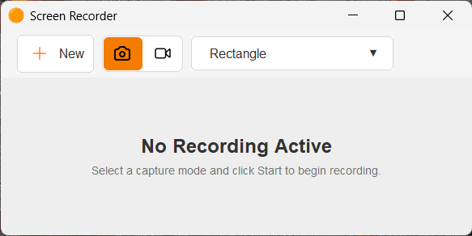
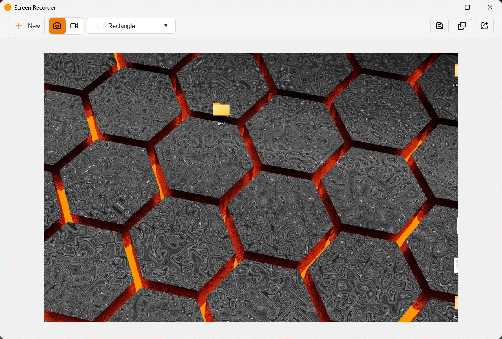
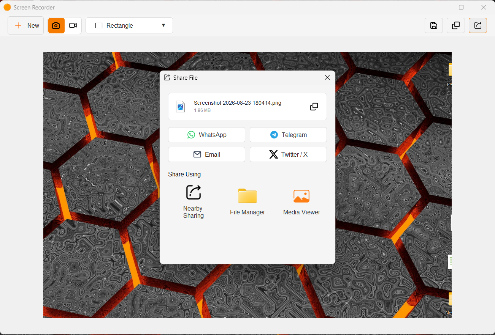
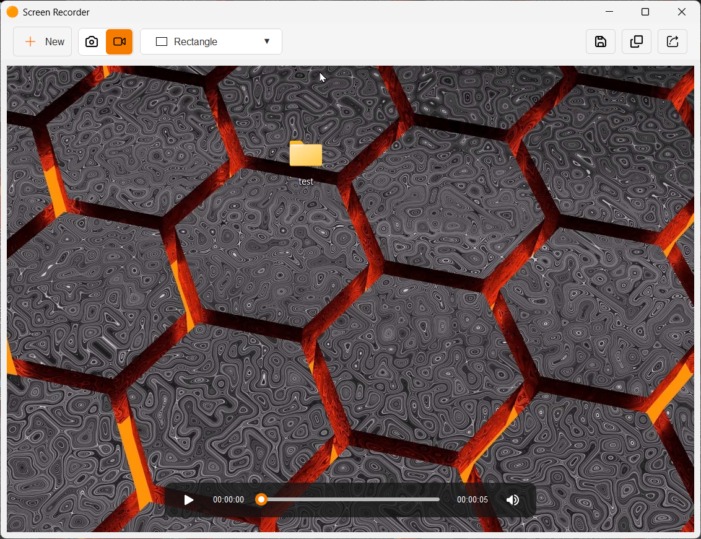

# Screen Recorder

A lightweight screen recorder application built with **Java Swing**, providing screen recording, media playback, audio capture, and local file sharing capabilities.

## Features

* Screen recording with a Java Swing user interface
* Screen and audio capture
* Windows system audio recording using **WASAPI**
* Microphone audio support
* Video playback using **JavaFX**
* Native Windows integration using **JNA**
* Local network file sharing using **LocalSend**
* Media processing and encoding support
* Cross-component integration between Swing and JavaFX

## Technology Used

* **Java 22**
* **Java Swing** — Desktop user interface
* **JavaFX** — Media playback and video rendering
* **Xuggler / Xuggle Xuggler** — Media processing
* **JNA / JNA Platform** — Native Windows API integration
* **WASAPI** — Windows audio capture
* **LocalSend** — Local network file sharing

## Project Structure

The application is primarily implemented as a Java desktop application using Swing, with JavaFX components used where media playback and rendering are required.

## Screenshots

  

    
  

  

    
        
  

  

     
  

## Requirements

Before running the application, make sure the following are available:

* Java 22 or later
* Windows OS for WASAPI and Windows-specific functionality
* Required JavaFX libraries
* Required native libraries for JNA and media processing

## Getting Started

Clone the repository and open the project in your preferred Java IDE.

Configure the required JavaFX libraries and native dependencies, then run the main application class.

> **Note:** Some features, particularly WASAPI audio capture and Windows native integration, are Windows-specific.

## License

This project is currently under development.
