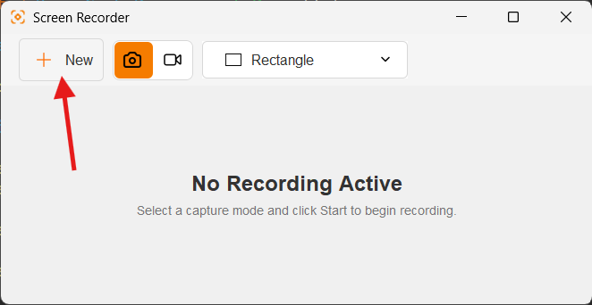
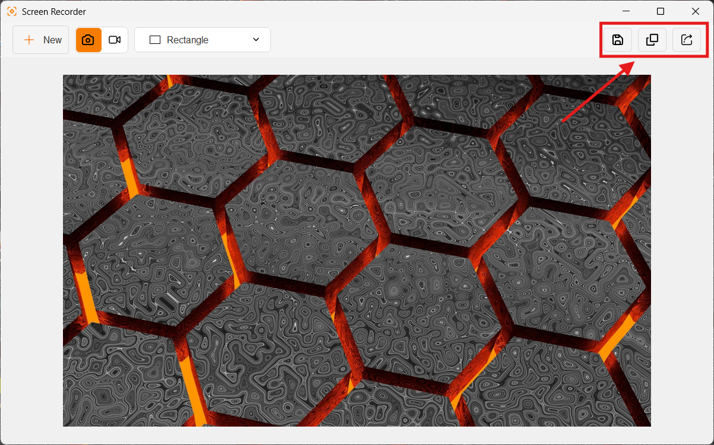

# Take a screenshot

1. Open Screen Recorder.
2. In the toolbar, select the camera icon for `Screenshot` mode.
3. Choose a capture mode: `Rectangle`, `Window`, or `Entire Screen`.
4. Click **New**.
5. Select the area. In rectangle mode, drag across the area; in window mode, point at the window to select it.
6. Finish the selection. The image opens in the built-in image viewer.

  

    
  

## After capture

Use the toolbar actions to:

- Save a copy to a location selected in the file chooser.
- Copy the captured image file to the system clipboard.
- Open the sharing dialog.

  

    
  

Screenshots are initially saved using the configured save location. The current source default is the Windows desktop path in `AppConstant.SAVE_LOCATION`.
